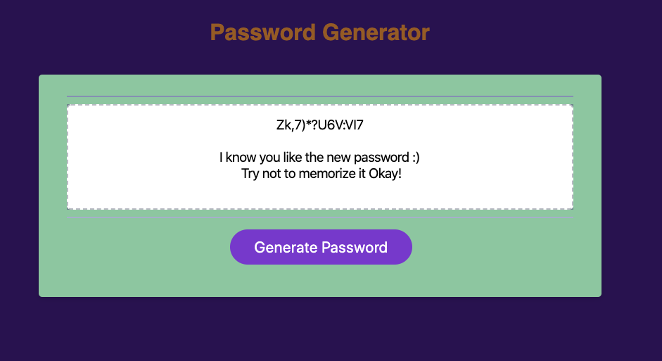

   # HomeWork_3#
Created Random Password Generator 

# Requirement:
A requirement of minimum of 8 and maximum of 128 characters is given to user. If user choses to pick number of characters within the range given, the application produces an alert to the user and shuts down.

# User preferrences:
User is asked in mutiple prompts for the criteria which he/she wants to chose from, 
1) Capital Letters
2) Small Letter
3) Special Characters
4) Numbers
* If user choses none of these, the application alerts the user with a  message and shut down.

# Generate:
If the the user choses some characters and range lies within the password criteria, a random password is then saved into the application. Upon clicking the purple generate button, the passward is displayed on user window, alongside a message for the user.

# Display Demo:

# Deployed application link :
               
               
* https://hmsalmans.github.io/homework_3/

